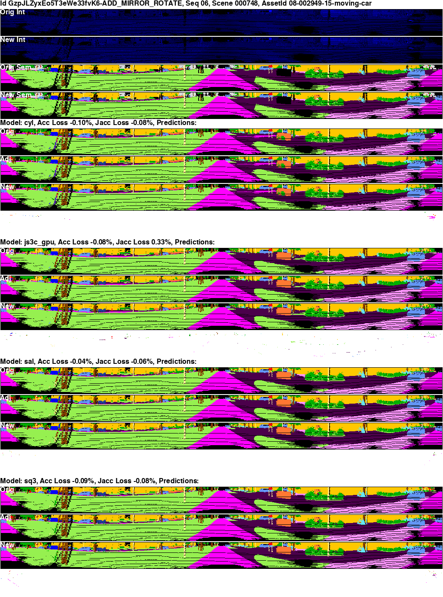
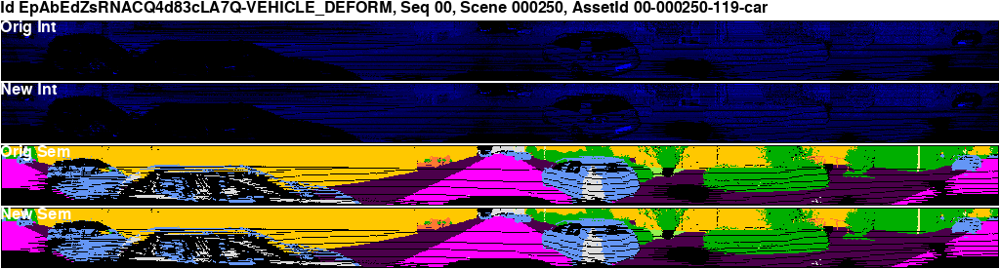

# Options for Running
The table below gives a quick reference for the ways to utilize this repository to quickly see a demo of the tool. The first option is the most prohibitive due to OS limitations. If you cannot run the full demo with SUTs, consider running the demo without the SUTs (option 2) or investigating the study data (option 3).

| Type                                       | Requirements                                                                             | Description                                                                                                                                                               | Section | Command                               |
|--------------------------------------------|------------------------------------------------------------------------------------------|---------------------------------------------------------------------------------------------------------------------------------------------------------------------------|---------|---------------------------------------|
| Full Demo with SUTs in Docker              | Ubuntu 18.04 due to graphics driver compatibilitiy issues with higher versions of Ubuntu | This runs the full mutation generation pipeline on a small subset of the SemanticKITTI data set and then runs 4 of the 5 SUTs from the study on the generated test cases. | [Full Demo with SUTs](#running-the-containerized-demo)| `cd ./tool/ && ./tool_demo.sh`        |
| Mutation Generation in Docker without SUTs | Ubuntu > 18.04, tested on Ubuntu 18.04 and Ubuntu 20.04                                  | This runs the full mutation generation pipeline on a small subset of the SemanticKITTI data set.                                                                                                                          | [Mutation Generation Demo without SUTs](#running-without-suts)| `cd ./tool/ && ./tool_demo_no_sut.sh` |
| Recreating Figures & Tables in Docker      | Ubuntu > 18.04, tested on Ubuntu 18.04 and Ubuntu 20.04 | Downloads the raw study data and recreates the Figures and Tables from the paper, along with many others.|[Recreating Figures & Tables](#recreating-study-figures)|`cd  ./study/ && ./generate_figures.sh` |
| Running Locally                            | Ubuntu 18.04 due to graphics driver compatibility issues with higher versions of Ubuntu. | Installing the tool locally allows for complete customization of the setup. The full installation has only been attempted on Ubuntu 18.04 |[Installing Locally (not recommended)](#installing-locally)|N/A | 
## Table of Contents
* [Full Demo with SUTs](#running-the-containerized-demo)
* [Mutation Generation Demo without SUTs](#running-without-suts)
* [Recreating Figures & Tables](#recreating-study-figures)
* [Installing Locally (not recommended)](#installing-locally)

# Running the Containerized Demo
For artifact evaluation or for a short demonstration of the tool, use the [./tool_demo.sh](./tool/tool_demo.sh) file.
This script has only been narrowly validated on Ubuntu 18.04 with CUDA 10.0 and cudnn 7.0. 
If you encounter issues running the `./tool/tool_demo.sh` script, the section below ["Running without SUTs"](#running-without-suts) contains information on running the minimal version of the mutation generation section of the tool.

This executable shell script will build, download, and setup all of the necessary dependencies using Docker Compose.
The [./tool README](./tool/README.md) contains more information.

```bash
cd ./tool/
./tool_demo.sh
```

While running, the script will output various messages detailing the status of the installation and tool run.
Building the Docker containers will take ~20 minutes, downloading and running Resource Collection will take ~10 more minutes, running the mutations will take ~10 more, and then the SUTs will take ~10 more.
Once initial builds have been completed, subsequent runs should take ~10 min. 
Note that warning/status messages may appear from internal components; these are normal.

Example Output (numbers quoted below may vary based on randomization/machine differences):
```
Setting up Docker container
Building gen_lidar_tests
...
Downloading selected data to use for generating tests
...
Performing Resource Collection
...
Ran for 00:07:41
Resource Collection Complete
Setting up SUTs
...
Starting Model Base Prediction Maker
...
Starting Model Evaluation Upload
...
DONE ACC JAC:

cyl
0.9391238636832958
0.5042026616496076
js3c_gpu
0.9387479595770283
0.4891203859190113
sal
0.9249892060509505
0.4406978101733467
sq3
0.9268331443619375
0.41221747658750213
...
Starting LiDAR Test Generation
...
Saving Results at: /root/sample_tool_output/VEHICLE_INTENSITY_2023_01_27-09_51_35
...
Starting LiDAR Test Generation
...
Saving Results at: /root/sample_tool_output/ADD_ROTATE_2023_01_27-09_52_55
...
Starting LiDAR Test Generation
...
Saving Results at: /root/sample_tool_output/ADD_MIRROR_ROTATE_2023_01_27-09_54_27
...
Starting LiDAR Test Generation
...
Saving Results at: /root/sample_tool_output/SCENE_REMOVE_2023_01_27-09_55_58
...
Starting LiDAR Test Generation
...
Saving Results at: /root/sample_tool_output/SIGN_REPLACE_2023_01_27-09_58_06
...
Starting LiDAR Test Generation
...
Saving Results at: /root/sample_tool_output/VEHICLE_DEFORM_2023_01_27-09_59_34
...
Starting LiDAR Test Generation
...
Saving Results at: /root/sample_tool_output/VEHICLE_SCALE_2023_01_27-10_00_53
...
Data has been saved to semLidarFuzz/tool/sample_tool_output.
Each mutation has a separate folder containing the SUT performance in csv files in the output/ folder.
The output/finalvis/<mutation_name>/ folder contains visualizations of the mutation as well as SUT performance.
Given the small number of mutations created during the demo, it is normal to not find any failures.
```
Below is an example of one of the generated visualizations:
<div style="white-space: nowrap">
  
</div>

# Running without SUTs
This script will run the mutation generation portion of the tool, but will not run the SUTs on the generated test cases.
This is useful as the GPU/Docker integration to run the SUTs works in a much narrower range of environments. 
This script has been validated on Ubuntu 18.04 and Ubuntu 20.04.

```bash
cd ./tool/
./tool_demo_no_sut.sh
```

While running, the script will output various messages detailing the status of the installation and tool run.
Building the Docker containers will take ~20 minutes, downloading and running Resource Collection will take ~10 more minutes, running the mutations will take ~10 more.
Once initial builds have been completed, subsequent runs should take ~10 min. 
Note that warning/status messages may appear from internal components; these are normal.

After completion, the script will display:
```
Data has been saved to semLidarFuzz/tool/sample_tool_output.
Each mutation has a separate folder containing the generated mutations.
The output/finalvis/<mutation_name>/ folder contains visualizations of the mutation.
```


Below is an example of one of the generated visualizations:
<div style="white-space: nowrap">
  
</div>

# Recreating Study Figures
The complete raw data from the study is available on Zenodo. We provide the [./study/generate_figures.sh](./study/generate_figures.sh) script which will download the study data and recreate all of the figures and tables from the study. Please see the [study README](./study) for more information and additional discussion on study results.

# Installing Locally
To install the tool locally, follow instructions in the [./tool README](./tool/README.md).
This requires additional manual support and is not recommended unless you are attempting to 
