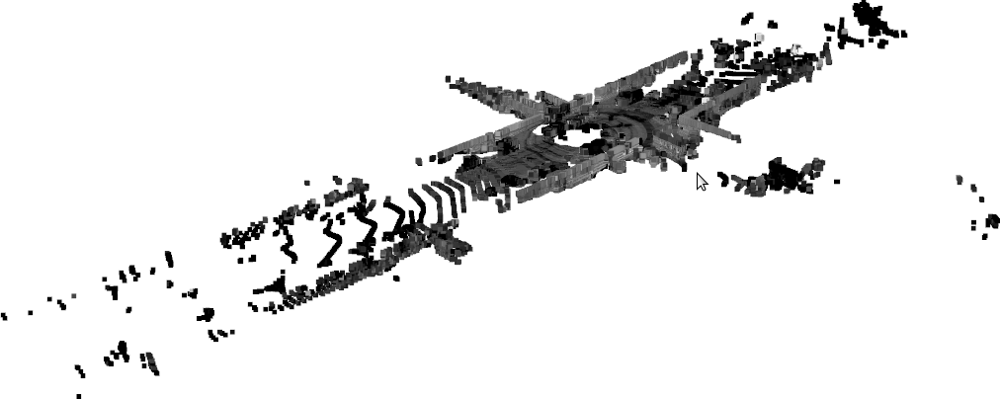

# Generating Realistic and Diverse Tests for LiDAR-Based Perception Systems

Tool and study data for Generating Realistic and Diverse Tests for LiDAR-Based Perception Systems.

We propose a new technique in testing LiDAR-based perception systems that takes as input existing real-world labeled LiDAR test cases, as shown below, and then mutates them to generate novel, realistic test cases that can expand the diversity of tests to explore the long-tail of possible scenes.

**Example point cloud and labelling**
<div style="white-space: nowrap">
  
  
</div>


**Example mutations**

<table>
<tr><th><b>Adding Entities</b></th><th><b>Removing Entities</b></th><th><b>Altering Entities</b></th></tr>
<tr><td>
<br>

</td><td>
<br>

</td><td>
<br>

</td></tr></table>

## Running the Demo
Instructions and troubleshooting available in the [INSTALL.md](./INSTALL.md) file.

The [./tool directory](./tool) contains the source code for the tool as well as a script (`./tool_demo.sh`) for running a minimal complete example of the mutations implemented in the tool and explored in the study.
The tool begins by performing Resource Collection (Approach in Section II-B, Implementation in Section III-A), then generates the 7 mutations discussed in the Section VI Table III.

The demo scripts use [Docker and Docker Compose](https://docs.docker.com/compose/install/) and these must be installed.
The docker script will download a small subset of the SemantiKITTI dataset, run Resource Collection on this subset, and then generate 5 mutations of each type.
The selected data will be downloaded in `./selected_data/` and tool demo output will be produced in `./sample_tool_output/`. 
The output contains the raw `bin` and `label` files, along with visualizations in the `final_viz` folders.

Within the `./selected_data/` folder, the `bin` files are the raw LiDAR point clouds with intensities, and the `label` files contain the ground truth semantic labeling with instances included in the SemanticKITTI format.
After running the Resource Collection phase, the `label` files will be modified in place to contain the additional entities identified (Section II-B).

Within the `./sample_tool_output/` folder, the new mutations will each be in separate folders of the form `<mutation name>_<timestamp>/`. 
Each mutation folder will contain a `/output/done/` folder that contains a set of  


To run the tool demo, use the following command. Building the Docker containers will take ~10 minutes, downloading and running Resource Collection will take ~10 more minutes, and then running the mutations will take ~10 more. There will be progress announcements throughout.
```bash
cd ./tool/
./tool_demo.sh
```

## Data from the Paper Study
Similar Docker scripts to recreate the figures and tables from the paper are available in the `./study` [directory](./study). Please refer to that README for more information.

### False Positive Discussion
As noted in the paper, humans are not well suited to judge realism for LiDAR point clouds.
Examples of false positive and true positive failures as determined by our voting mechanism discussed in Section IV-C-2 are available in [the study false positives folder](./study/false_positives).

## Additional Implementation Details
As noted in Section III, the implementation of only three of the basic mutation operations were selected for discussion. 
Complete discussion of all of the basic mutation operations are available in [this supplement](Generating%20Realistic%20and%20Diverse%20Tests%20for%20LiDAR-Based%20Perception%20Systems%20Additional%20Implementation%20Details.pdf). 
