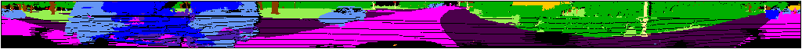

# Discussion of False Positives
As discussed in the paper, humans are not well suited to judge the realism of LiDAR point clouds.
Here we give several examples of true and false positives identified in the study.

## False Positives
As discussed in Section IV-C-3, the voting mechanism sets a threshold, V, for determining if a test case is a false positive based on if V or more SUTs failed on that test case.
In Table IV, shown above, we use V=3 as the threshold. Below we examine several examples of false positives found:

### Accuracy Metric
Under the accuracy metric we find only 6 of the 167 failures are false positives. We examine two examples below:

#### Example 1
In the below example, the mutation takes a point cloud containing a truck and alters the intensity of the points so that they are at a much lower intensity than before.
Looking at the image, we can clearly identify that the truck is now appears much darker; however, it appears to be at a similar intensity level as the car in the background behind it.
This very clearly demonstrates how humans are ill-suited for judging realism for LiDAR, as we have no inherent intuition for intensities.

Original Labeling:

Original Intensities:

With Vehicle Intensities altered:

The JS3C-Net (17.5%), SalsaNext (17.2%), and SqueezeNetV3 (14.9%) models failed on this test. 
For each of the SUTs, we see that they mislabeled different regions of the truck, confusing it for truck versus car versus bus.
Further, these mislabelings appear in splotches that do not seem to correlate with any specific aspect of the vehicle.

JS3C-Net Performance:

SalsaNext Performance:

SqueezeNetV3 Performance:

#### Example 2
In the below example, the mutation takes a point cloud in which the vehicle is driving on a street and adds a car on the street partially in the grass.
Visually inspecting the new image, there is no clear indication why this might not be realistic.
The added vehicle appears partially off the roadway, but this is a reasonable location for the car; perhaps this vehicle had an accident and pulled off of the road into the grass.
The car appears large; however, this is the same distance that the car was in its original point cloud so that is realistic.
There are a few regions around the car where there are no LiDAR readings (shown in black), but this happens at various places around the image, so while this may be part of the issue it is not possible to intuit directly.

Original:

With Vehicle Added:

The Cylinder3D (15.1%), SPVNAS (7.0%), and SalsaNext (8.1%) models failed on this test. 
Their labelings are shown below. 
For each of the SUTs, we see that they mislabeled different regions of the added vehicle, confusing it for car versus bus versus building.

Cylinder3D Performance on new PC:

SPVNAS Performance on new PC:

SalsaNext Performance on new PC:

### Jaccard Metric
Under the accuracy metric we find only 175 of the 1638 failures are false positives. We examine two examples below:

#### Example 1
In the below example, the mutation adjusts the scale of the truck (purple) in the upper right of the image.
This is the only example where our intuition may tell us this could be a false positive.
We can see that in the updated image, the truck appears to have shrunk and left a hole shown in black.
Further investigation is required to understand what might have caused this issue.

Original:

With Vehicle Scale Adjusted

The Cylinder3D (5.7), SPVNAS (7.6), and JS3C-Net (7.5) models failed this test under the Jaccard metric.
In each case we can see that the SUT mislabeled the truck as either a bus (blue) or building (orange), which led to a large change in the Jaccard metric since there are no other trucks in the scene.

Cylinder3D Performance:

SPVNAS Performance:

JS3C-Net Performance:

#### Example 2
In the below example, the mutation adds a mirrored sign in the sidewalk on the right side of the image.
Although sidewalks are typically free from signs, this is still physically feasible in rare circumstances, and so it is difficult for a human to judge if there is something unrealistic about the way this sign appears in this context.
This may demonstrate how this method of determining false positives can over-estimate the amount of false positives as a very difficult but realistic test case may lead to multiple failures and thus be marked as a false positive.
In this case, perhaps the sign is entirely realistic but the uncommon placement of the sign has yielded multiple failures.

Original:

With Added Mirrored Sign:

The Cylinder3D (10.2), SalsaNext (10.0), and SqueezeNetV3 (9.6) failed this test under the Jaccard metric.
In each of the three cases we can see that the model mislabeled the added sign as building; since there are no other signs in the image, missing this class leads to a large change in the Jaccard metric.

Cylinder3D Performance:

SalsaNext Performance:

SqueezeNetV3:

## Different choices of `V`
Note, the columns here are *not* cummulative. 
When evaluating false positives as in the study, a false positive is determined based on a number of SUTs greater than or equal to `V`.
This table is presented based on equal to `V`. Sum the columns to the right to find the aggregate false positive metric.
<table>
<tr><th></th><th colspan="6">Accuracy</th><th colspan="6">Jaccard</th></tr>
<tr><td>Mutation </td><td> Total </td><td> 1 SUT </td><td> 2 SUTs </td><td> 3 SUTs </td><td> 4 SUTs </td><td> 5 SUTs </td><td> Total </td><td> 1 SUT </td><td> 2 SUTs </td><td> 3 SUTs </td><td> 4 SUTs </td><td> 5 SUTs</td></tr>
<tr><td>Add Rotate</td><td>41 </td><td> 27 </td><td> 12 </td><td> 1 </td><td> 1 </td><td> ---</td><td>711 </td><td> 430 </td><td> 204 </td><td> 56 </td><td> 16 </td><td> 5</td></tr>
<tr><td>Add Mirror Rotate</td><td>44 </td><td> 35 </td><td> 7 </td><td> 2 </td><td> --- </td><td> ---</td><td>751 </td><td> 433 </td><td> 239 </td><td> 61 </td><td> 12 </td><td> 6</td></tr>
<tr><td>Remove</td><td>6 </td><td> 6 </td><td> --- </td><td> --- </td><td> --- </td><td> ---</td><td>26 </td><td> 25 </td><td> 1 </td><td> --- </td><td> --- </td><td> ---</td></tr>
<tr><td>Vehicle Intensity</td><td>65 </td><td> 55 </td><td> 8 </td><td> 2 </td><td> --- </td><td> ---</td><td>182 </td><td> 151 </td><td> 27 </td><td> 4 </td><td> --- </td><td> ---</td></tr>
<tr><td>Vehicle Deform</td><td>5 </td><td> 5 </td><td> --- </td><td> --- </td><td> --- </td><td> ---</td><td>10 </td><td> 10 </td><td> --- </td><td> --- </td><td> --- </td><td> ---</td></tr>
<tr><td>Vehicle Scale</td><td>12 </td><td> 12 </td><td> --- </td><td> --- </td><td> --- </td><td> ---</td><td>95 </td><td> 70 </td><td> 11 </td><td> 5 </td><td> 9 </td><td> ---</td></tr>
<tr><td>Sign Replace</td><td>0 </td><td> --- </td><td> --- </td><td> --- </td><td> --- </td><td> ---</td><td>38 </td><td> 34 </td><td> 3 </td><td> 1 </td><td> --- </td><td> ---</td></tr>
<tr><td>Total</td><td>173 </td><td> 140 </td><td> 27 </td><td> 5 </td><td> 1 </td><td> ---</td><td>1813 </td><td> 1153 </td><td> 485 </td><td> 127 </td><td> 37 </td><td> 11</td></tr>
<tr><td>%</td><td> </td><td> (81%) </td><td> (16%) </td><td> (3%) </td><td> (1%) </td><td> </td><td></td><td> (64%) </td><td> (27%) </td><td> (7%) </td><td> (2%) </td><td> (1%) </td></tr>
</table>